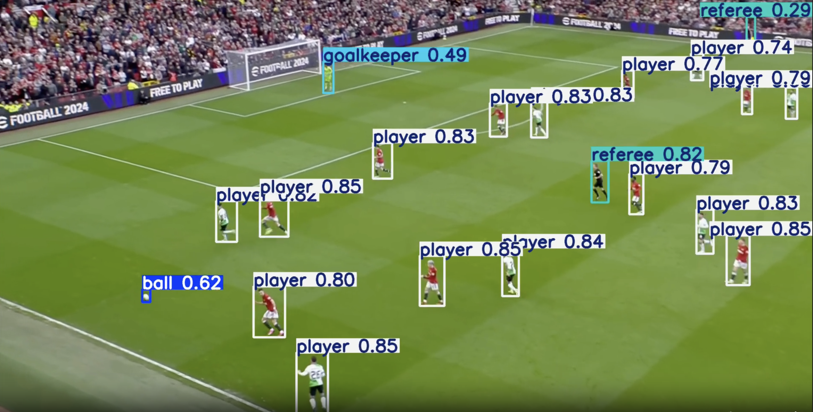
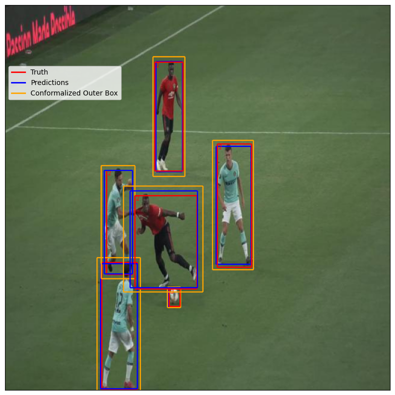
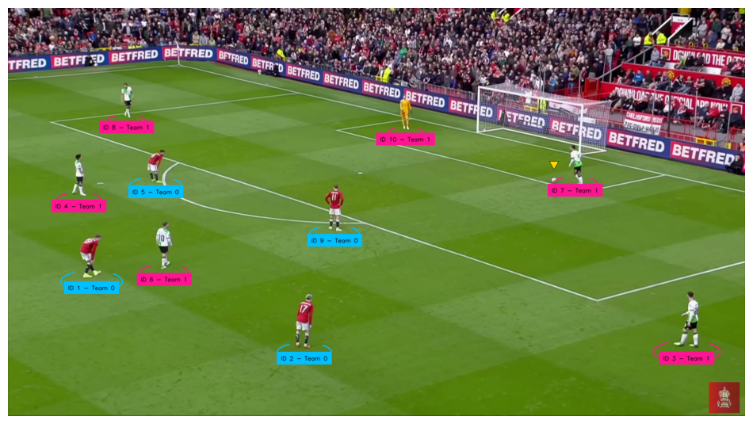
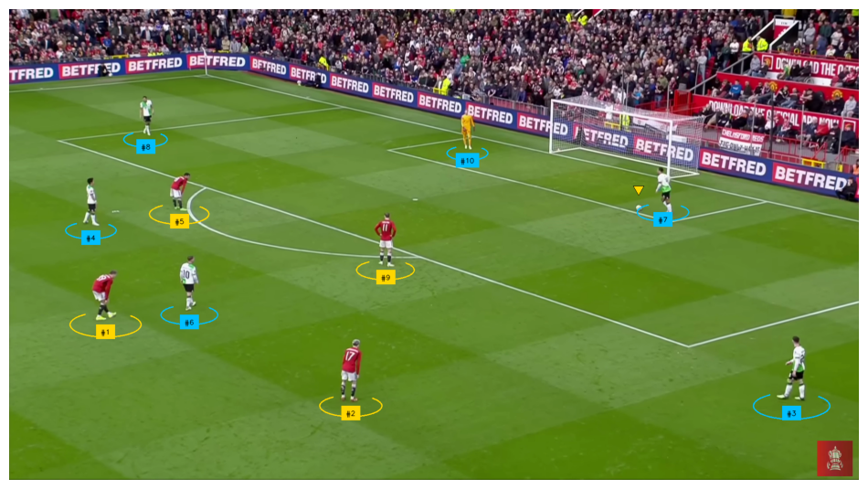

# ⚽️ FOOTCVISION : Computer Vision Applied to Football

## **Roadmap** 🛣️

### **Phase 1: Player Detection and Conformal Prediction** 🏃‍♂️⚽️

1. **YOLOv11 Fine-Tuning for Player Detection** 🎯
<!-- Center the image using HTML -->
<div align="center">
  
</div>

2. **Conformal Object Detection with puncc library** 📏
<div align="center">
  
</div>
 
---

### **Phase 2: Ball Tracking and Player Statistics** 🎥⚽

1. **Ball & Player Tracking** ⚽
The first video is ball & player tracking with HSV Classifier and the second is from the Kmeans classifier.
<div align="center">
 

</div>

2. **Player Statistics** 📈

---

### **Phase 3: Two Approaches for Team Differentiation** 📊
   - **HSV Classifier**:
     - Extract **HSV colors** from bounding box regions of detected players.
     - Cluster players into teams based on dominant uniform colors.
<div align="center">
  
</div>

   - **K-Means Clustering for Team Analysis**:
     - Use player positions (bounding box coordinates) and CLIP features to cluster players into two teams.
<div align="center">
  
</div>       
---

### **Phase 4: Offside Detection** 🚩

1. **Rule-Based Offside Detection**
   - Utilize player positions and ball location to detect offside scenarios.
   - Apply rule-based AI to automate offside decision-making.

---

## **Installation and Usage** 🚀

### **Clone the Project**
```bash
git clone https://github.com/alyasltd/FootCVision.git
```

### **Install Dependencies**
```bash
pip install -r requirements.txt
```
